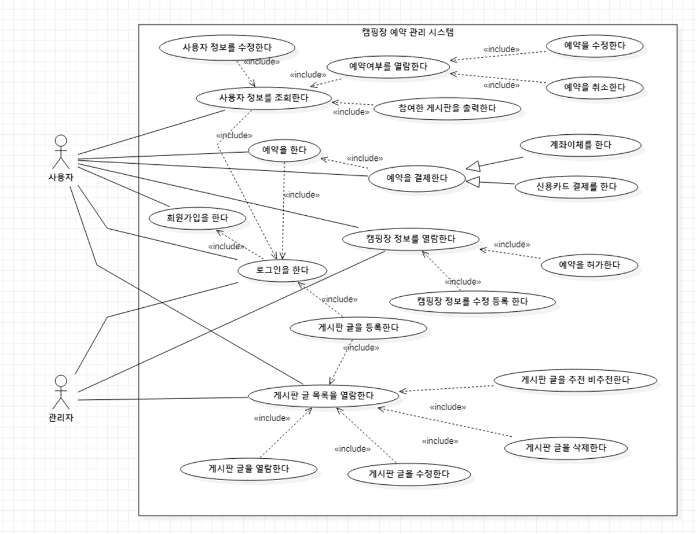
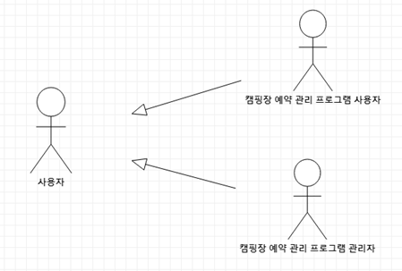

# 2 week

### 팀회의

1. 2021년 4월 7일 / 오후 12시 00분 / 비대면 온라인
    - 참석자 : 전원
    - 회의 안건 : 요구사항 분석 작성, 시스템 개요 작성, 비기능 요구사항 작성

    ---

    예약관리

        예약 허가

        예약 열람

        예약 수정

        예약 취소

    게시판

        후기

        공지

        질의응답

    글 작성 시에만 로그인 필수

    관리자는 게시판 글 추천기능이 없다

    게시판 글을 비추천 가능합니다.

    - **유스케이스 목록**

    **로그인한다**

    **회원가입한다**

    **[예약하기]**

    **예약한다**

    **신용카드로 결제한다**

    **계좌이체로 결제한다**

    **+결제는 예약 허가 이후인가, 아니면 허가 전 선결제인가?**

    **=> 신용카드는 자동허가 처리, 계좌이체는 입금 후 허가**

    **[예약 관리]**

    **<사용자>**

    **예약을 확인한다**

    **예약을 수정한다**

    **예약을 삭제한다**

    **<관리자>**

    **예약을 관리한다**

    **예약을 수락한다**

    **=> 예약을 반려하는 기능은 삭제했다**

    **[캠핑장 정보]**

    **캠핑장 정보를 올린다**

    **+캠핑장 정보를 관리한다(수정, 삭제?, 확인)으로 바꾸어야 하는가?**

    **[게시판]**

    **게시판을 확인한다**

    **게시판에 글을 올린다**

    **게시글에 감정을 표시한다**

    **<사용자>**

    **개인 게시글을 삭제한다**

    **개인 게시글을 수정한다**

    **개인 게시글을 확인한다**

    **(사용자 정보 부분에도 해당.** 사용자가 자신이 참여한 게시판들의 목록이 표시된다. 게시판을 클릭하면 해당 게시판 화면으로 이동한다.**)**

    **게시글을 검색한다**

    **=> 개인 게시글을 관리한다 / 게시글을 검색한다 로 줄일 수 있는가?**

    **<관리자>**

    **게시판을 관리한다**

    **모든 게시글을 수정한다**

    **모든 게시글을 삭제한다**

    **(include 가 아닌 것 같다)**

    **[사용자 정보]**

    **사용자 정보를 수정한다**

 - **유스케이스 다이어그램**
    **(초안)**
    </img> 

 - **엑터**
    **(초안)**
    </img> 
