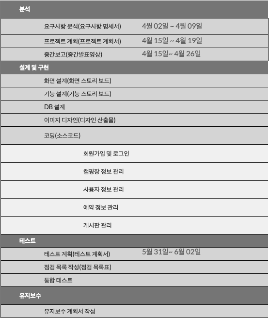
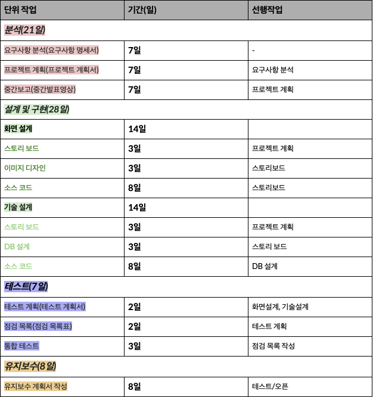

### 팀 회의
  2021년 4월 15일 / 오후 2시 / 비대면 온라인
    - 참석자 : 전원 
    - 회의 안건 : 프로젝트 계획서 작성 회의

---

    역할분담
      - 발표문 작성, PPT 작성 및 발표문 수정, 발표문 수정 및 발표

    발표 목차
      - 작품소개, 구현할 목록, 유스케이스 소개, 화면 프로토타입 등

  회의 내용

    프로젝트 계획서 목차

    1.	프로젝트 개요
    1.1	목적
    1.2	주요 일정	
    1.3	조직
    1.3.1	조직도
    1.3.2	역할 및 책임	
    1.4	생명주기 모델	
    1.5	도구	
    2.	규모 산정	
    2.1	WBS(Work Breakdown Structure)	
    3.	일정	
    4.	산출물 관리	
    5.	위험 관리 계획	

   WBS Work Breakdown Structure
    단계(level)가 아래로 내려갈수록 프로젝트의 작업들이 점차적으로 상세히 정의  
    괄호 안 내용은 해당 작업 수행 시 나타나는 산출물
    </img> 
    
    </img> 

   조치 사항
    프로젝트 계획서 초안 작성
   다음 회의 안건
    프로젝트 중간발표 영상 제작 회의
